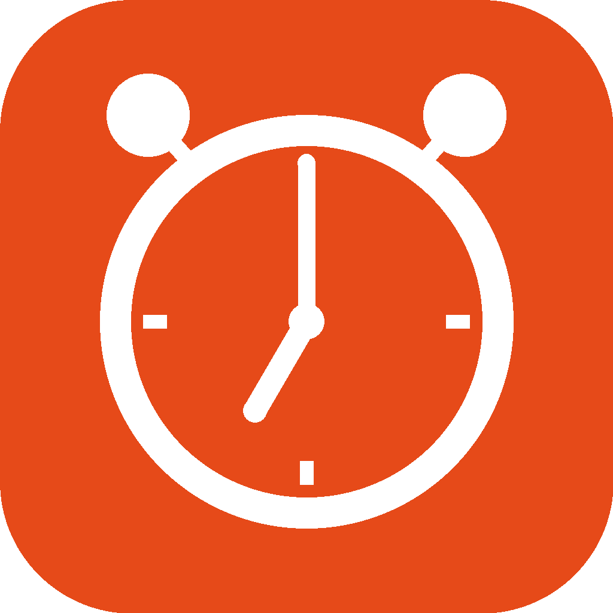
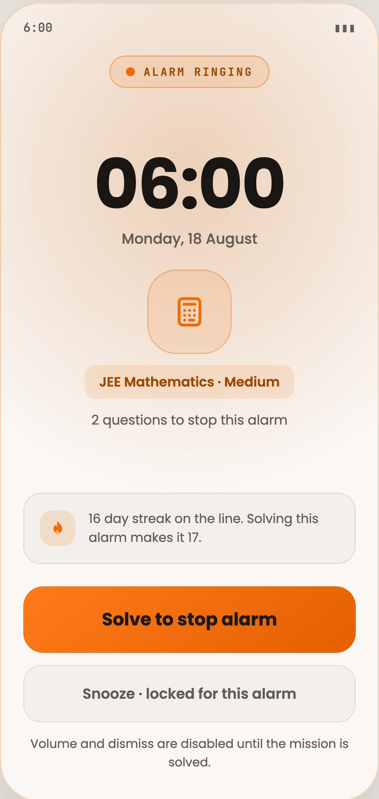
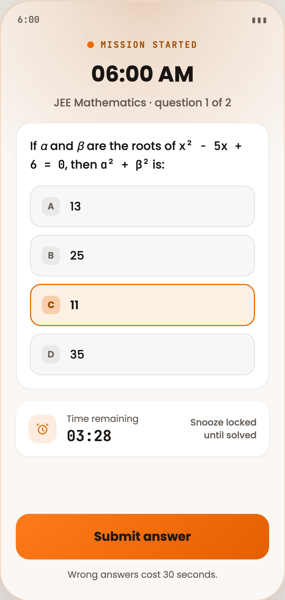
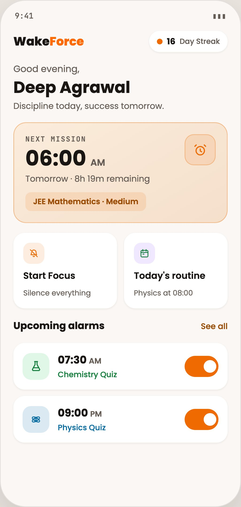
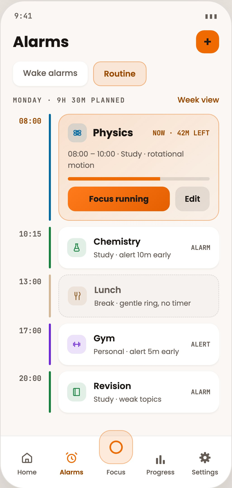
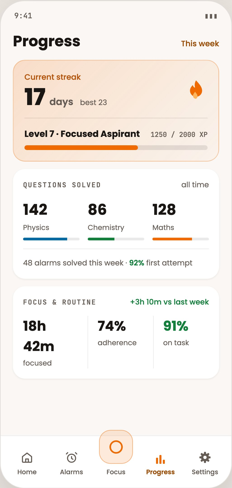
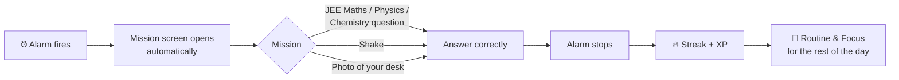
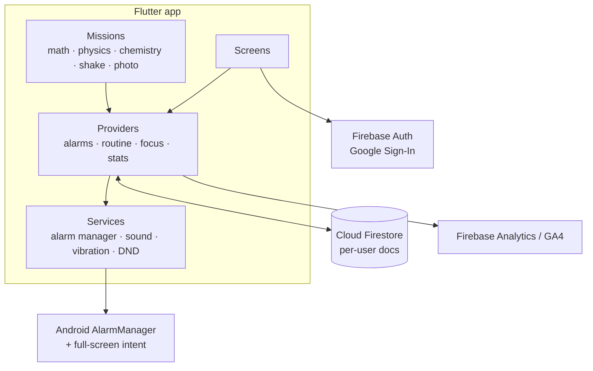

<div align="center">



# WakeForce

**The alarm that won't stop until you solve a JEE question.**

An Android app that helps JEE aspirants protect their morning study hours. You wake up with a mission, plan the day, and stay in focus.


</div>

<p align="center">
  
  
  
  
  
</p>
<p align="center"><sub>Alarm → JEE mission → Home → Daily routine → Progress (screens shown with demo data)</sub></p>

---

## The problem

JEE aspirants plan to study early and then lose that time to the snooze button. A normal alarm is too easy to dismiss half-asleep.

## The solution

WakeForce keeps ringing until your brain is awake. To stop it, you must complete a **mission**. Once you're up, it helps you use the day: a planned study routine, distraction-free focus sessions, and streaks that make the habit stick.

## How it works



## Features

| | Feature | What it does |
|---|---|---|
| 🧠 | **Wake missions** | The alarm only stops when you solve a real JEE Maths, Physics or Chemistry question, shake the phone, or photograph your saved desk. Snooze stays locked until the mission is done. |
| 📱 | **Full-screen ringing** | The mission screen opens on its own at alarm time. There's no notification to tap first. |
| 📅 | **Study routine** | You plan the day as study, break and personal blocks. Each block can ring like an alarm when it starts. |
| 🎯 | **Focus sessions** | Goal or open timers with Do Not Disturb, a picker for apps to block, interruption counts, and adherence against your plan. |
| 🔥 | **Streaks and XP** | Every solved mission and focus minute earns XP. Daily streaks build the habit. |
| ☁️ | **Account sync** | With Google sign-in, streaks, alarms and routine come back after a reinstall or on a new phone. |
| 💬 | **In-app feedback** | Students rate the app and leave a note, and the owner reads it all in an in-app inbox. |

## Product approach

WakeForce was built solo, from idea to a live MVP used by JEE students.

- **Ship small, then learn.** It started as an alarm with a JEE question. Everything after that came from daily conversations with active users.
- **Measure what matters.** Firebase Analytics and GA4 track mission completions and cohort retention, and those numbers set the roadmap.
- **Reach users directly.** A signed APK is shared with students, outside the Play Store. See [RELEASE.md](RELEASE.md).

## Architecture



```
lib/
├── missions/   one file per wake mission
├── data/       JEE question banks (Maths, Physics, Chemistry)
├── models/     alarm, routine block, focus session, user stats
├── services/   alarms, sound, vibration, focus/DND, cloud sync, analytics
├── screens/    UI
└── widgets/    shared components
test/           156 widget and unit tests
```

## Tech stack

**App:** Flutter · Dart · Provider · Android AlarmManager · local notifications · sensors · on-device image similarity<br/>
**Backend:** Firebase Auth (Google Sign-In) · Cloud Firestore · Firebase Analytics · GA4

## Getting started

```bash
git clone https://github.com/Deep0976/wakeforce.git
cd wakeforce
flutter pub get
flutter test      # 156 tests
flutter run       # Android device or emulator
```

Release signing is covered in [RELEASE.md](RELEASE.md). The signing key is never committed.

## Privacy and security

Firestore rules give each student read and write access to their own documents only. Feedback is create-only, and every other collection is denied by default. See [`firestore.rules`](firestore.rules).

---

<div align="center">
Built by <a href="https://github.com/Deep0976">Deep Agarwal</a>
</div>
